# Docker Tutorial

https://youtu.be/fqMOX6JJhGo

## High-Level Overview

### Why do you need docker

- Compatibility/Dependency
    - Compatibility of the services used with the version of OS you are planning to use
    - Compatibility between the services, librairies and dependencies on the OS

    So whenever we have to change a version of a service, we have to check compability with the other services and if needed change the version of the other cervices, or the OS
    This compatibility issue is called The matrix from Hell.
- Long setup time for the developer
- Different dev/test/prod environments


 
### What can it do

- Able to run each component in a seperate container with has its own dependencies and libraries on the same VM and OS but within seperate envionments.

- Make docker configurations only once and every developer can get started with a simple docker run command, irrespective of their OS, all they need is docker installed.

### What are containers

Containers are isolated environments with their own processes and services, their own network interfaces, their own mounts except they all share the same OS kernel

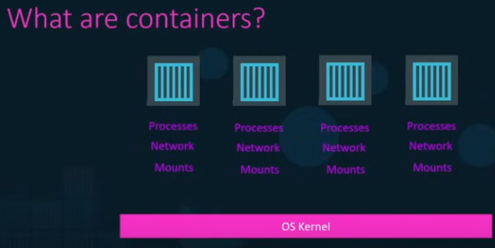


### Operating System

Debian
Ubuntu
Fedora
CentreOS  

for examples are all Linux-based OS

They have the same kernel, which is Linux


OS= OS kernel+ set of software

The OS kernel is reponsible for interacting with the underlying hardware

Sofware: user interfaces, drivers, compilers, file managers, developer tools

#### Container sharing a kernel

Let us consider a Ubuntu OS with Docker installed on it

Docker can run any containers on that OS as long as they are all based on the same kernel, which is in this case Linux.

- For ex we can not run a windows based container on a docker host with Linux on it

- When you run a linux container on Windows, Windown run the continer on a LInux VM.

### Containers vs VMs

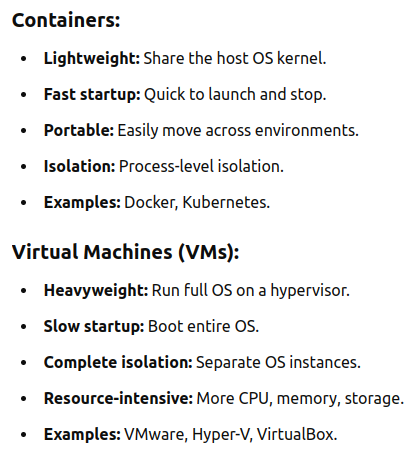

### Containers vs Images

- An image is a package or template or a plan, used to create one or multiple containes

- Containers are runnable instances of images that are isolated and have their own environments and set of processes

## Get started with Docker

### Docker editions 

2 editions available 
- Community Edition
    - A set of free products
    - Available for 
        - Linux
        - MAC 
        - Windows 
        - Cloud platforsm: AWS, Azure, etc

- Entrprise edition

  - certified and supported container platform that comes with entreprise additional features such as
    - image management
    - security
    - universal control plane for managing and orchestrating container runtimes
  - not free

### Installation

Check docker installation by running 

```bash
docker run hello-world
```

### Docker commands

#### docker run

Run a container from an image

If not yet pulled the image is pulled for the first time the command is runned

```bash
docker run img_name
```

#### docker ps

```bash
docker ps
```

List all running containers with informations such as

- container id
- the image name
- the creation date
- current status
- the ports used
- the name of the container: a random name assigned


```bash
docker ps -a
```

List all containers including those which are not running anymore(stoppped or exited containers inclued)

To avoid randomly assigned containers name, you can use 
```bash
docker run --name=ubuntu_container ubuntu
```

This command allows you to assign a name to your container.

#### docker stop

```bash
docker stop container_id
```

```bash
docker stop container_name
```

Used to stop a running container, by providing either its id or its name.

#### docker rm

```bash
docker rm container_id
```

```bash
docker rm container_id
```

Remove a stopped or exited container. Cannot remove a running container. Stop it first

#### docker images

```bash
docker images
```

List the availble docker images on your machine.

#### docker rmi 

```bash
docker rmi image_name
```

Remove a container image. The image should not be in use by any existing container, which is running, exited or stopped. The related containers should have been stopped and remved before the image can be removed

#### docker pull

```bash
docker pull image_name
```

Download a docker image

#### Run attach and detach

By default docker containers are runned in foreground more, ie in atach mode

You can run docker containers in backgro ud mode also called etached mode


```bash
docker run -d  ubuntu  sleep 100
```

Use attach to run the container in attach mode again(may be after executing detaxh)

```bash
docker attach container_id
```

Not that when specyfing container id, you are not obliged to specify the full ...


### docker exec

Executing Commands in a Running Container
To execute a command in a running container, use the docker exec command. For example, to list files in the objective_boyd container with is already running:


```bash
docker exec objective_boyd ls
```

To test it run ubuntu container with the sleep process in detach mode.

```bash
docker run -d  ubuntu  sleep 600
```
Then execute the ls command in the running container.

```bash
docker exec 62d05fe5d16af7 ls
```


#### Interactive and TTY mode 

Try to execute bash command in the previously running ubuntu container

```bash
docker exec 62d05fe5d16af7 bash
```

You might notice that the container exits immediately. This happens because the container does not stay running once its primary task is completed.

### Why Interactive and TTY Modes are Useful
To prevent the container from exiting and to interact with it, you need to use the -i and -t options:

- Interactive Mode (-i): Keeps STDIN open even if not attached, allowing you to interact with the container.
- TTY Mode (-t): Allocates a pseudo-TTY, which is useful for interactive sessions.
When combined (-it), these modes enable you to run a container interactively. For example, to start an interactive bash session inside a new Ubuntu container, use:

```bash
docker exec -it 62d05fe5d16af7 bash
```
Now you can run any bash commands you want  in the terminal.

## Image tag

```bash
docker run redis
```

Redis version=7.2.5 shown in the output.

Let us try with a specific version of redis, 7.2.4 for example


```bash
docker run redis:7.2.4
```

Since the image dosnt exist yet it will download it and then run the docker container with the specified docker image version.

You can list the images and you will se an entry for redis with the new version of redis pulled from docker hub, 7.2.4

```bash
docker images
```

redis:7.2.4 is called tag

The default tag is considered to be latest when any version is specified. That is a tag associated to the latest version of an image.

So the command 

```bash
docker run redis
```

is equivalent to

```bash
docker run redis:latest
```

## Port mapping

- Map availble port on a docker container to another port on docker host

- So you can 
  - acess the docker container port via the host
  - run as many as instances of that container just by mapping them to different host ports


```bash
docker run -p host_port:container_port container_img
```

For example redis runs on the port 6379, you can map that port to another port on the host 

```bash
docker run -p 6379:6379 redis
```

```bash
docker run -p 4000:6379 redis
```
```bash
docker run -p 6000:6379 redis
```

## Volumes mapping

- For data persistence in a docker container

- When you run for example a redis container, all the data stored in the database are available in the folder /data. 

But when you stop the container every stored data is lost

To persist your data you have to map that container directory  to a directory on your host

```bash
docker run -v host_directory:container_directory container_img
```

For redis for ex

```bash
docker run -v ./redis_data:/data redis
```

## Inspect container

```bash
docker inspect container_id_or_name
```

- See additional details on a specified continer. These details include
  -  id
  - name
  - state
  - network setting
  - mount points
  - environment variables
  - etc


```bash
docker inspect loving_roentgen
```

## Container logs


```bash
docker logs container_id_or_name
```

```bash
docker logs youthful_davinci
```

## Environment variables

When we use env variables in the code of our apps we can specify a value for them when running the container, using the e option


```bash
docker run -e ENV_VAR=value container_image
```

## Images

Creating one own image

### When do you need to create your own image?

- You cannot find a component or a service that you want to use as a part of your application on Docker Hub
- You decide the app you are developping will be dockerized for ease of shipping  and deployment

### How do do it?

Steps for a flask web app container

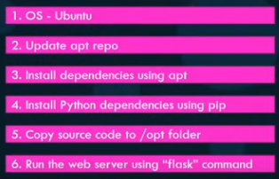

You have to create a docker file named Dockerfile and write the  instructions for setting up your applications in it, such as
- installing dependencies
- where to copy the source code from and to
- the entry point or command
- etc


Use docker build to build the image


```bash
docker build Dockerfile -t tag_name
```

```bash
docker build Dockerfile -t starias/my_img
```

This create the image localy on your system

Run docker push to upload the  image to docker hub


### Dockerfile

- A dockerfile is a text file written in a specific format that Docker can understand. It is in intrustuctions and arguments format.
- Example of Dockerfile
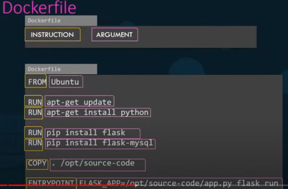

Everything on the left is an instruction and everything on the right is an argment of those instruction.

FROM: The base docker image to use: This should be the first command in ll dockerfile
RUN: Uses to run commands for installing dependencies

COPY: used to copy files. copy source codes of the application for example

ENTRYPOINT: Allows us to specify a command that will be runned when the image is runned as a container

### Layered architecture


When docker builds images it does it in  a layered architectire

Each line of instruction in the Dockerfile creates a new layer in the docker image with just the changes from the previous layer. This behavious is reflected in the image size in each layer.

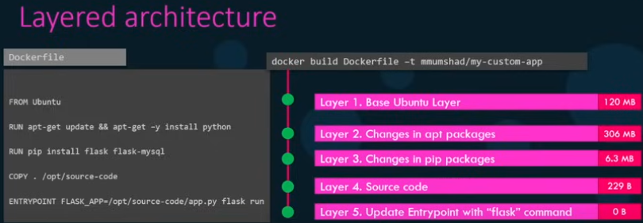

Run docker history to see the informations about each layer of an already built docker image.
```bash
docker history img
```

Also, informations are displayed about eah step, ie the current layer, during the docker image build

With that approach, in case of fail of the build or in case of an update of the Dockerfile, the build resumes at the specific layer where the issue occurs, or when a modifiction appears. THis then accelerates the build process without rebuilding the image from the first layer.

What can you contenerize?

Everything: applictions, databaes, etc.

### CMD vs ENTRYPOINT

Containers run and execute a specific task, after that they exit.

CMD stands for command and defines the programm that will be runned within the container when it starts.

For ex for the mysql official image it is the mysqld command

```dockerfile
CMD ["mysqld"]
```

For ex for the nginx official image it is the nginx command

```dockerfile
CMD ["nginx"]
```

For ex for the ubuntu official image it is the bash command

```dockerfile
CMD ["bash"]
```

bash is not really a process, it is just a shell. When you run an Ubuntu image as container, as no terminal is attached the container looks for the terminal and doesnt find it then it exit. That is why ubuntu container exit just after start running.

Solution: Append a command to the docker run commmead


```bash
docker run ubuntu sleep 100
```

But how to make this permanent ie for ex make the sleep command always run when the docker containers starts.

Do it using the CMD instruction in the docker file.

2 ways to do it 


First approach, the simple way, as is in a shell form

```dockerfile
FROM ubuntu
CMD sleep 5
```

Second approach, in a JSON array format: The first eement of the array should be the executable, sleep in this case. The command and its paramertes should be together. They should be seperated

```dockerfile
FROM ubuntu
CMD["slep" "5"]
```


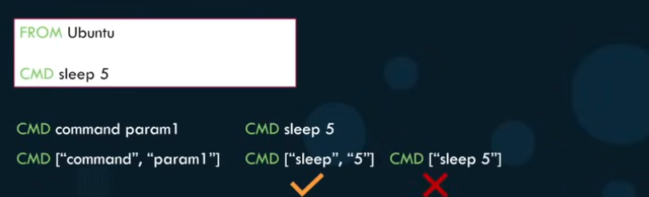

```bash
docker build -t ubuntu-sleeper
```

```bash
docker brun ubuntu-sleeper
```

Suppose we wanna do something like   

```bash
docker run ubuntu-sleeper 20
```

such that we can ourselve during the run, specify the duration we want the docker container to sleep.

That is where the ENTRYPOINT instruction come into play

With the the ENTRYPOINT instruction we have to specify only the programm to be runned by the container, without its parameter.

```dockerfile
FROM ubuntu
ENTRYPOINT ["sleep"]
```

Then we can run our container like this

```bash
docker run ubuntu-sleeper 20
```

In that case When you run the container without specifying any parameter, ie the slepp duration, you will get an error since the the docker container try to run the sleep command, which requires an argument.

We can specify a default value for our programm by using both entrypoint and CMD instructions in our docker file. 

```dockerfile
FROM ubuntu
ENTRYPOINT ["sleep"]
CMD ["5"]
```

The entrypoint can be modified during runtime. This can be done using the entrypoint option

```bash
docker run --entrypoint programm ubuntu-sleeper opt
```

Ex

```bash
docker run --entrypoint echo  ubuntu "Hello everyone"
```
Where programm represent the new entry programm to run and opt represent the option

### Networking


After docker installation, 3 networks are created automatically.

There are 
1. Bridge

2. none
3. host

Bridge is the default network a container get attached to.

A private internal network created by docker on the host
The running containers can all acess each other within this network.

You can use the network option to specify the network you want the docker container get attached to.


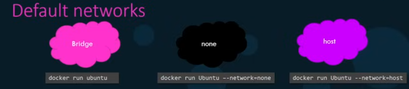

```bash
docker run container_img --network the_network
```

EX

```bash
docker run --network=none  ubuntu
```

```bash
docker run --network=host  ubuntu
```

#### User defined networks

What if we wanna isolate the containers within the docker host, ie group containers by networks

In that case we should create our own docker networks

This is done using the command docker network create

```bash
docker  network create --driver bridge --subnet ip_adress network_name
```

Run docker network ls to list all the available docker networks

```bash
docker  network ls
```

To see the network and ip address of a container, run docker inspect and look for the bridge section

```bash
docker  inspect container_id_or_name
```

### Embedded DNS

Containers can use their IP addresses to acces each others. But this is not a good approach cause ip address can change. The best approch is to use container names. Using that approach, docker use a Domain Name Resolution to resolve the  ...


### Storage

Additional detail on Layerd architecture

When building a docker file with similar content with a previously built dockerfile, docker use the the previous layer from cache and just start from the line where a difference starts

If the first 3 lines intructions of the second dockerfile are as same as the ones in the first dockerfile, docker is not going to create the first 3 layers again. Docker will use cached layers from cache and then create only the last layers, which are different ... ...

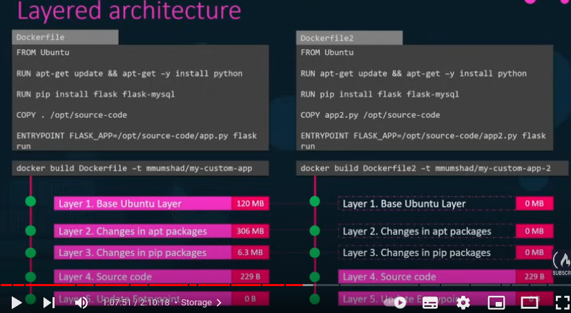

When an image is built the cached layers are read-only and then can not be modified.


When you run a container, docker create a new writable layer on top of the layers of the image.

This writable layer is used to store data created by the container such as log files used by the container, any files modified by the user on the container, etc

The  life duration of that container is limited to the file duration of that container. When the container is stopped, that layer is destroyed with all the changes stored on it.


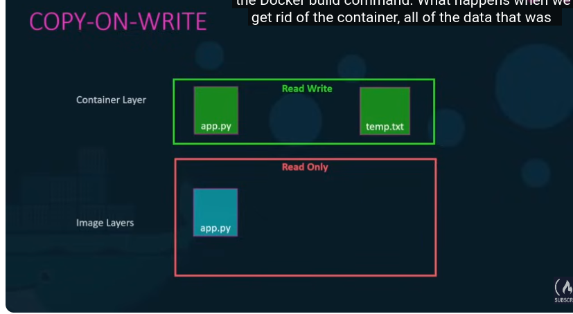

We use volumses to persist the data


### Docker compose

Used to create a configuration file in YAML format, docker-compose.yml  and put inside different services with their run options. Then we can run docker compose up to get all services run 


### Docker container name

The name option can be used to specify a name to the container. With that approach the container name wont be setted randomly anymore.

```bash
docker run --name=ubuntu_container ubuntu
```

### Links
--link

I dont really understand links


The container name is used to create links between containers.


Docker compose versions
1,2,3

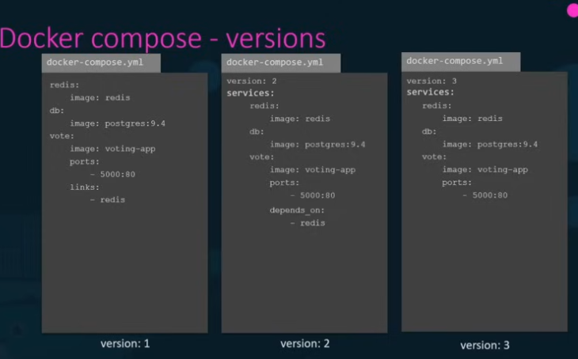

### Docker registry
Docker registry

It is the location whre all docker images are stored and download from

ex docker hub=docker repository=docker.io

In fact docker images are stored on docker repositories, which are like docker account names.

When identifying a docker image with its name without specifying its repository, docker assumes that the repository is as same as the name for ex whenyou run docker run redis  docker runds docker run redis/redis

the first redis is the docker repository and the seond one is the name od the image container.

Other examples of registries  google registry gcr.io  kubernetes

Private registry

Login befroe pushing to or pulling frm a private registry

to login use docker login command


### Docker Engine

A host with docker installed on it.


### Docker architecture

Docker architecture consists of three main components:

- Docker client
- Docker host
- Docker registry

### Docker host
- 3 components are installed when you install docker
  - docker daemon: a background process that manages docker objects such as dockerfile, docker images, containers, volumes and networks
  - the REST API server: an API interface that programms can use to talk to daemon and provide instructions, used to interact with the daemon
  - the docker CLI: the command line interface that we have been using until now to perform actions such as running, stopping container, destroying images, etc.

- These 3 componenets form the docker engine

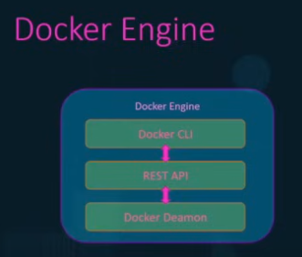


- The docker CLI is not obliged to be on the same host as the 2 other containers. I can be a remote service installed on another machine. The option H is ued to connect a docker CLI to a remote docker engine

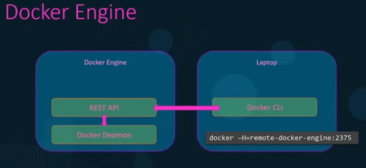

### Docker registry

#### Docker registry
- used to distribute docker images, can be either public or private
- Used for the storage and distribution of container images. Its most basic functions are to store images and retrieve them.
Screenshot from 2024-07-27 04-52-56
- a hosted service containing repositories of images which responds to the Registry API.

- Acessed via push and pull commands
- Example: docker.io

#### Docker repository
repository is a set of Docker images. A repository can be shared by pushing it to a Docker registry. The different images in the repository can be labelled using tags.

#### Image tag
A tag is a label applied to a Docker image in a repository. Tags are how various images in a repository are distinguished from each other
tag=image name+version

#### Docker image identifier
image=registry+repository+tag
registry/repository:tag   

- tag consists of the name and the version of the image the default version, latest is applied when no version is specified

- The name of the repository is used as image name if the image name is not specified

- Example: docker.io/ubuntu:18.04


### Container Orchestration

- A solution that consists of a set of tools or scripts that can help to host containers in a production environment
- typically Consists  of multiple docker hosts that can host containers, such that if one fails, the application is still acessible through the others

- help you to deploy several instances of your application in a single command 

Some solutions help to automatically scale up the number of instances of your applications when the users increase and scale it down when demands decrease
Some solutions can help you automatically adding additional hosts to suport users load


- EX of docker orchestration solutions
  - Docker swarm from Docker: easy to set up but lacks of the advanced auto scaling features required for complex production grade apps
  - kubernetes from Google: popular, a bit difficult, many feautes
  - mesos from Patchy?
  - Marathon
  - Nomad

Use YAML or JSON configuration files
### Docker Swarm

Combine multiple docker machines together into a single cluster.

Docker swarm will then take care of distributing your services or your app instances into seperate hosts for high availability  and for load balancing accross different systems

To set up a docker swarm you must have multiple hosts with docker installed on them, then you choose one host to be the manager or the master or the swarm manager and the others as slaves or workers or nodes.

Run the docker swarn on the master to initialize the swarm manager

The output of that command provides the cmd to run on the workers
Copy ond run it on each worker in order to allow them to join the manager.

### Kubernetes

According to the official Kubernetes documentaion

"Kubernetes also know as K8s is an open-source system for automating deployment, scaling and management of contenerized applications."

Developped by Google
Maintained by the Cloud Native Computing Foundation
